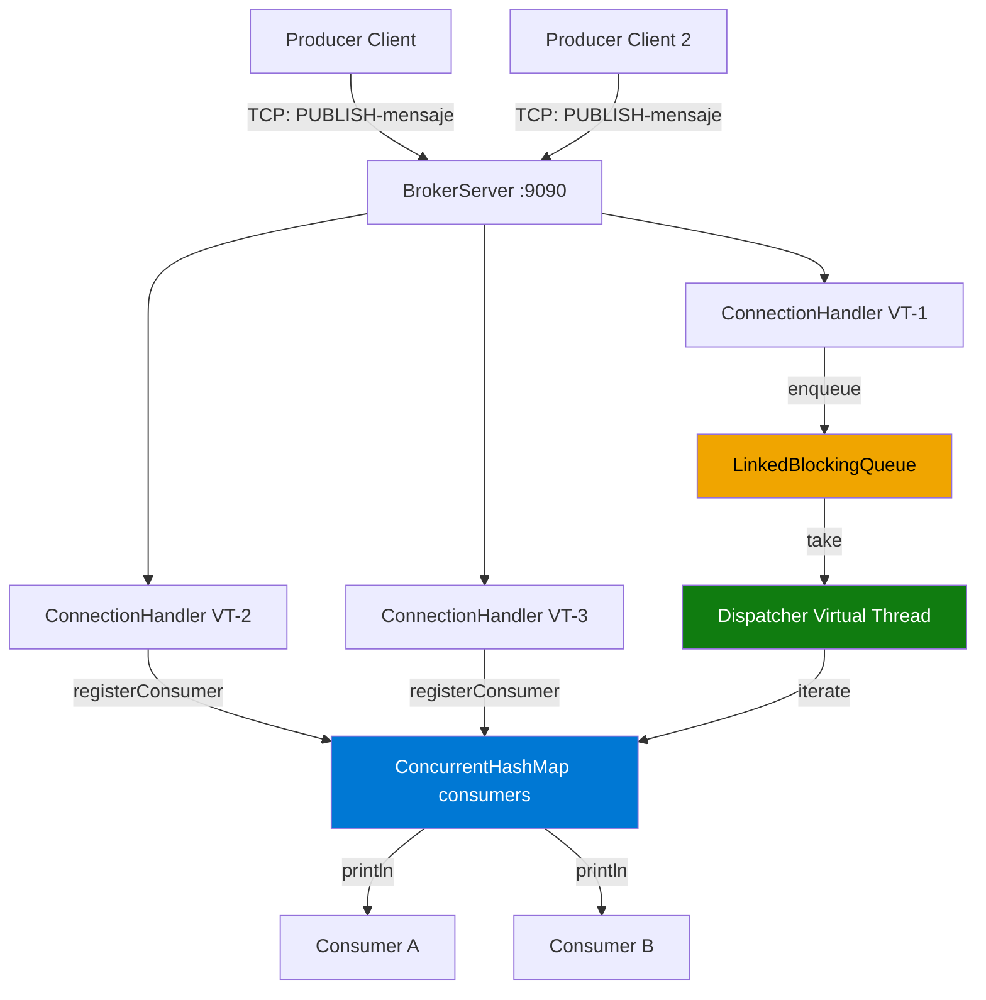

# Message Broker POC — Java 21

Implementación desde cero de un **Message Broker** usando únicamente el JDK de Java 21.  
Sin frameworks, sin dependencias externas. Solo Java puro.

---

## Stack Tecnológico

| Componente | Tecnología | Versión |
|---|---|---|
| Lenguaje | Java | 21 (LTS) |
| Concurrencia | Virtual Threads (Project Loom) | Java 21 |
| Cola de mensajes | `LinkedBlockingQueue` | JDK |
| Registro de consumers | `ConcurrentHashMap` | JDK |
| Transporte | `ServerSocket` / `Socket` TCP | JDK |
| Build tool | Apache Maven | 3.6+ |
| Modelo de datos | Java `record` | Java 16+ |

---

## Ventajas de esta implementación

### Virtual Threads (Project Loom)
- **Sin límite práctico de conexiones**: a diferencia de threads del OS (~10.000 máximo), los Virtual Threads escalan a cientos de miles.
- **Código síncrono, ejecución asíncrona**: se escribe código bloqueante simple y la JVM lo optimiza internamente usando continuations.
- **Cero overhead del OS scheduler**: el JVM gestiona los Virtual Threads sobre un pool pequeño de OS threads.

### LinkedBlockingQueue
- **Thread-safe por diseño**: múltiples productores y un dispatcher operan concurrentemente sin `synchronized` manual.
- **Backpressure natural**: si la cola está llena, `put()` bloquea al productor automáticamente, evitando `OutOfMemoryError`.
- **Sin busy-wait**: `take()` duerme el thread eficientemente hasta que haya un mensaje disponible.
- **Orden garantizado**: semántica FIFO estricta.

### ConcurrentHashMap
- **Alta concurrencia sin bloqueo global**: usa segment locking (y CAS en Java 8+) en lugar de bloquear toda la estructura.
- **Iteración segura**: el dispatcher itera sobre consumers mientras otros threads los registran/desregistran.

### Sin dependencias externas
- **Cero vulnerabilidades de supply chain**: no hay JARs de terceros que actualizar.
- **Arranque instantáneo**: sin Spring context, sin classpath scanning.
- **Transparencia total**: todo el código del broker es tuyo y está completamente comentado.

---

## Arquitectura del Sistema

```
┌──────────────────────────────────────────────────────────────────────┐
│                         BROKER SERVER :9090                          │
│                                                                      │
│  ┌─────────────────┐    ┌──────────────────────────────────────────┐│
│  │  ServerSocket   │    │           ESTADO COMPARTIDO              ││
│  │   accept()      │    │                                          ││
│  │   ↓ ↓ ↓ ↓       │    │  LinkedBlockingQueue<Message>           ││
│  └────────┬────────┘    │  ┌──────────────────────────────────┐   ││
│           │              │  │  msg1 │ msg2 │ msg3 │ ...        │   ││
│   ┌───────▼──────────┐   │  └──────────────────┬─────────────-┘   ││
│   │ ExecutorService  │   │                      │                   ││
│   │ (VirtualThread   │   │  ConcurrentHashMap<id, PrintWriter>     ││
│   │  per task)       │   │  ┌─────────────────────────────────┐   ││
│   │                  │   │  │ consumer-A → PrintWriter(socket) │   ││
│   │ VT-1: Producer   │   │  │ consumer-B → PrintWriter(socket) │   ││
│   │ VT-2: Consumer A │   │  └──────────────┬──────────────────┘   ││
│   │ VT-3: Consumer B │   │                  │                       ││
│   └──────────────────┘   │  VT-dispatcher ──┘                      ││
│                           │  (dispatchLoop)                         ││
│                           └──────────────────────────────────────────┘│
└──────────────────────────────────────────────────────────────────────┘

         ↑ TCP                                    TCP ↓
┌─────────────────┐                    ┌───────────────────────┐
│  PRODUCER       │                    │   CONSUMER A/B/...    │
│                 │                    │                        │
│  teclado →      │                    │   stdin bloqueado      │
│  PUBLISH|msg    │                    │   MSG|id|ts|content ↓  │
│  ────────────── │                    │   display en consola   │
└─────────────────┘                    └───────────────────────┘
```

### Diagrama de componentes



---

## Flujo End-to-End

```
TIEMPO    PRODUCTOR              BROKER                     CONSUMER
──────    ─────────────          ─────────────────────      ──────────────────

T=0                              [START] Escuchando :9090

T=1       connect :9090  ──────► acepta conexión TCP
          send "PRODUCER" ────► identifica como PRODUCER
                          ◄───── "OK|Conectado como PRODUCER"

T=2       connect :9090  (otro terminal)              connect :9090 ──────►
                                                      send "CONSUMER" ────►
                                                      ◄───── "OK|Conectado..."

T=3       PUBLISH|Hola ──────►  ConnectionHandler recibe "PUBLISH|Hola"
                                Message.of("Hola")
                                  id: "a1b2c3d4-..."
                                  timestamp: "2025-01-15T10:30:00Z"
                                  content: "Hola"
                                messageQueue.put(message) ← encolado

T=4                              Dispatcher: messageQueue.take()
                                 serialized = "MSG|a1b2c3...|2025-01-15T...|Hola"
                                 for each consumer in ConcurrentHashMap:
                                   writer.println(serialized) ───────────────►
                                                                              recibe "MSG|..."
                                                                              parsea mensaje
                                                                              muestra en consola:
                                                                              ┌──────────────
                                                                              │ MENSAJE #1
                                                                              │ ID: a1b2c3d4...
                                                                              │ Timestamp: 10:30:00
                                                                              │ Contenido: Hola
                                                                              └──────────────
T=5       ◄────── "OK|Mensaje encolado con ID: a1b2c3d4..."
          [BROKER ACK] Mensaje encolado con ID: a1b2c3d4...
```

---

## Estructura del Proyecto

```
tarea04-poc/
├── README.md
│
├── broker-server/                          ← El broker (servidor)
│   ├── pom.xml
│   └── src/main/java/broker/
│       ├── model/
│       │   └── Message.java               ← Record: id, timestamp, content
│       ├── network/
│       │   └── ConnectionHandler.java     ← Maneja conexión individual (VT)
│       └── server/
│           └── BrokerServer.java          ← ServerSocket + Queue + Dispatcher
│
├── producer-client/                        ← Cliente que envía mensajes
│   ├── pom.xml
│   └── src/main/java/broker/
│       └── client/
│           └── ProducerClient.java        ← Lee teclado → PUBLISH|msg → TCP
│
└── consumer-client/                        ← Cliente que recibe mensajes
    ├── pom.xml
    └── src/main/java/broker/
        └── consumer/
            └── ConsumerClient.java        ← TCP → MSG|... → muestra en consola
```

---

## Cómo ejecutar localmente

### Pre-requisitos

- Java 21+ instalado (`java -version`)
- Apache Maven 3.6+ instalado (`mvn -version`)
- Tres terminales abiertas (una por componente)

### Opción A — Con Maven (desarrollo)

**Terminal 1 — Broker:**
```bash
cd broker-server
mvn compile exec:java
```

**Terminal 2 — Consumer** (conectar antes que el productor):
```bash
cd consumer-client
mvn compile exec:java
```

**Terminal 3 — Producer:**
```bash
cd producer-client
mvn compile exec:java
# Ahora escribe mensajes y presiona Enter
# Escribe "exit" para salir
```

### Opción B — Con JAR ejecutable

**Paso 1 — Compilar todo:**
```bash
cd broker-server  && mvn package -q
cd ../consumer-client && mvn package -q
cd ../producer-client && mvn package -q
```

**Paso 2 — Ejecutar:**
```bash
# Terminal 1
java -jar broker-server/target/broker-server.jar

# Terminal 2
java -jar consumer-client/target/consumer-client.jar

# Terminal 3
java -jar producer-client/target/producer-client.jar
```

### Orden de inicio

```
1. broker-server   (primero — levanta el servidor TCP)
2. consumer-client (segundo — se registra en el broker)
3. producer-client (tercero — empieza a enviar mensajes)
```

> **Nota:** El broker puede iniciarse en cualquier orden. Si el producer envía mensajes antes de que haya un consumer conectado, el dispatcher retendrá el mensaje hasta que un consumer se conecte.

---

## Protocolo TCP

El protocolo es texto plano sobre TCP. Cada línea termina con `\n`.

| Dirección | Comando | Descripción |
|---|---|---|
| Cliente → Broker | `PRODUCER` | Registrarse como productor |
| Cliente → Broker | `CONSUMER` | Registrarse como consumidor |
| Productor → Broker | `PUBLISH\|<contenido>` | Enviar un mensaje |
| Broker → Productor | `OK\|<mensaje>` | Confirmación |
| Broker → Productor | `ERROR\|<motivo>` | Error en el comando |
| Broker → Consumer | `MSG\|<id>\|<ts>\|<contenido>` | Entrega de mensaje |

---

## Concurrencia — Resumen de decisiones

| Estructura | Uso | Por qué |
|---|---|---|
| `Virtual Threads` | Una por conexión TCP | Escala sin límite de OS threads; código síncrono |
| `LinkedBlockingQueue` | Cola FIFO de mensajes | Thread-safe; backpressure; sin busy-wait |
| `ConcurrentHashMap` | Registro de consumers | Concurrencia segura sin bloquear toda la estructura |
| `ExecutorService` | Pool de VT por conexión | Gestiona ciclo de vida de threads automáticamente |
| Java `record` | Modelo de Message | Inmutabilidad; sin condiciones de carrera al leer |

---

## Prueba rápida con telnet/nc

Puedes probar el broker sin compilar los clientes:

```bash
# Terminal 1: Broker corriendo

# Terminal 2: Consumer manual
telnet localhost 9090
CONSUMER

# Terminal 3: Producer manual
telnet localhost 9090
PRODUCER
PUBLISH|Hola desde telnet!
```

---

## Limitaciones de esta POC

- **Sin persistencia**: si el broker reinicia, los mensajes en cola se pierden.
- **Sin autenticación**: cualquier cliente en la red local puede conectarse.
- **Sin topics/queues**: todos los mensajes van a todos los consumers (broadcast).
- **Single dispatcher**: un solo hilo despacha mensajes (suficiente para la POC).
- **Sin reintentos**: si un consumer falla al recibir, el mensaje no se reenvía.

Estas limitaciones son intencionales para mantener el código simple y didáctico.
